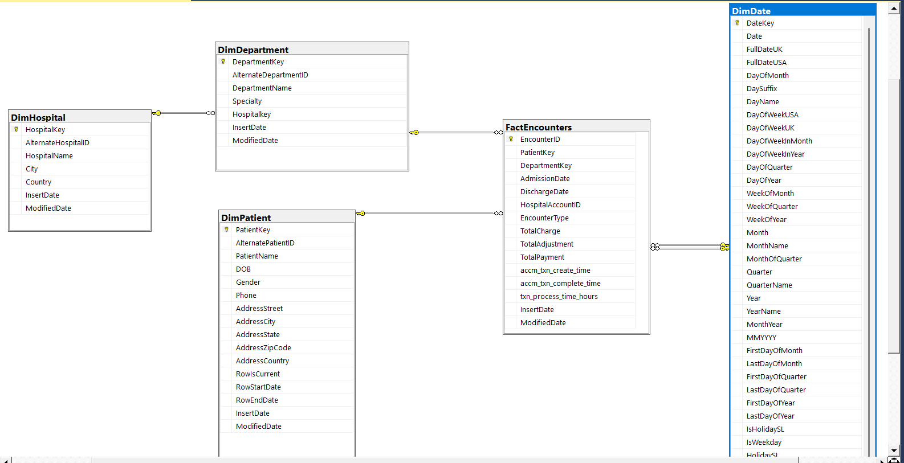

---
# Data-Warehouse-ETL-Project

A data warehousing project built using SQL Server, SSIS, and Visual Studio.

---

## 📁 Project Overview

The aim of this project was to:

- Select a real-world OLTP dataset
- Design and implement a dimensional data warehouse model
- Perform ETL (Extract, Transform, Load) using **SSIS**
- Handle accumulating fact tables
- Demonstrate BI capabilities using SQL Server tools

---

## 🧰 Tools & Technologies

- **SQL Server Management Studio (SSMS)**
- **SQL Server Integration Services (SSIS)**
- **Visual Studio**
- **CSV/Text/Excel Data Files**
- **Star/Snowflake Schema**
- **Dimensional Modelling & Slowly Changing Dimensions**

---

## 💾 Project Database File

A complete backup of the SQL Server database used in this project is available for download:  
📥 [Download .bak File on Google Drive](https://mysliit-my.sharepoint.com/my?id=%2Fpersonal%2Fit22184030%5Fmy%5Fsliit%5Flk%2FDocuments%2F3rd%20Year%202nd%2FDWBI%2FAssignment%2FDWBI%5FAssignment%5F02%5FAnswer%5FIT22184030&noAuthRedirect=1)

---

## 🧾 Selected Dataset

**Project Theme**: *General Hospital Management System*  
A simulated OLTP dataset capturing transactional and operational data across various hospital entities such as:

- Patients (Demographics)
- Encounters (Visits)
- Accounts (Financials)
- Physicians and Departments
- Hospitals and Branches
- Orders and Clinical Results

🟢 Data covers ~1 year and supports ETL, dimensional modeling, and OLAP use cases.

---

## 🧬 Data Sources

Two types of data sources were used to simulate real-world integration:

- **Source 1 – Flat File (CSV)**  
  `Patients.csv`: Simulates an external intake system  
  Contains: PatientID, Name, DOB, Gender, Address, etc.

- **Source 2 – SQL Server Database**  
  `GeneralHospital DB`: Includes Encounters, Departments, Hospitals, Accounts, etc.

This multi-source setup allowed demonstration of **ETL pipelines**, **lookups**, and **cleansing**.

---

## 🏗️ Solution Architecture

| Component        | Description |
|------------------|-------------|
| **Source Systems** | CSV and SQL Server OLTP |
| **ETL Layer**     | SSIS for extract-transform-load |
| **Staging DB**    | Intermediate cleaned/raw tables |
| **Data Warehouse**| Snowflake schema with Dim & Fact tables |
| **OLAP Layer**    | SSAS Cube (for hierarchies, KPIs, drill-downs) |
| **BI Tools**      | Power BI / SSRS for reporting and dashboards |

---

## 🗃️ Data Warehouse Design

A **Snowflake Schema** centered on the `FactEncounters` table was developed. Dimensions include:

- **DimPatient** *(SCD Type 2)*
- **DimDepartment**
- **DimHospital**
- **DimDate**

  

🔧 **Design Highlights**:
- Surrogate keys for all dimensions
- Patient info supports version tracking (SCD2)
- Department-Hospital foreign key for integrity
- Date dimension pre-generated (1+ years)

---

## ⚙️ ETL Process (SSIS)

Built with **SSIS**, the ETL pipeline includes:

### 🔄 Extraction
- Flat File Source for `Patients.csv`
- OLE DB Source for `Encounters`, `Departments`, `Accounts`

### 🧼 Transformation

Once data was extracted from both source systems (CSV and SQL Server), it was routed through the staging layer and transformed to fit the data warehouse structure. Staging tables acted as an intermediate repository for raw but structured data, enabling easier debugging, reloading, and transformation logic.

Before transformation, extracted data was loaded into staging tables in the SQL Server database. These included:
- StgPatients
- StgDepartments
- StgHospitals
- StgEncounters
- StgAccounts

- Data type conversion (e.g., DT_WSTR to DT_STR)
- Derived columns to clean IDs and normalize text
- Lookups to retrieve surrogate keys
- Merge Joins (e.g., Encounters + Accounts)
- Handling **Slowly Changing Dimensions (SCD Type 2)** using conditional splits and update flows

### 📥 Loading
- Dim tables loaded in order: `Date → Hospital → Department → Patient`
- `FactEncounters` loaded with keys and computed metrics (e.g., Length of Stay, Financials)

---

## 🕒 Accumulating Fact Table Handling

To simulate delayed updates:

- `accm_txn_create_time`: Set during initial load using `GETDATE()`
- `accm_txn_complete_time`: Updated later via separate ETL job
- `txn_process_time_hours`: Calculated using `DATEDIFF`

  

SSIS pipeline included:
- Derived Column for timestamps
- SQL-based `OLE DB Command` to perform updates

---

## 📊 Key Capabilities Demonstrated

✅ Multi-source data ingestion  
✅ Snowflake schema modeling  
✅ Surrogate key management  
✅ Lookup and transformation in SSIS  
✅ Slowly Changing Dimensions (Type 2)  
✅ Accumulating fact table updates  
✅ Staging & intermediate validation  
✅ Clean documentation with screenshots  

---

## 📜 License

This project is created for academic demonstration purposes. Reuse permitted with attribution.

---

